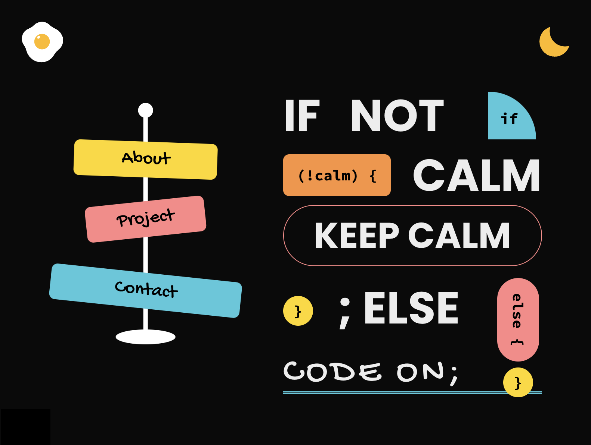

# 🌟 My Portfolio  

A **Single Page Application (SPA)** built with **Next.js**, styled with **Tailwind CSS**, and managed using **pnpm**.  
This portfolio showcases my experience, featuring links to my **resume, projects, and Medium articles**.  

## 🛠️ Tech Stack  
- **Frontend:** [Next.js](https://nextjs.org/)  
- **Styling:** [Tailwind CSS](https://tailwindcss.com/)  
- **Package Manager:** [pnpm](https://pnpm.io/)  
- **Hosting:** [Vercel](https://vercel.com/home)

⚠️ *Currently does not support responsive design (RWD), but improvements are planned.*  

## 📦 Installation  
1. Clone the repository:  
   ```sh
   git clone https://github.com/your-username/your-portfolio.git
   cd your-portfolio
   ```
2. ```sh
   pnpm install
   ```
3. ```sh
   pnpm dev
   ```
4. Open http://localhost:1234 in your browser.

## 📷 Preview


## 🎯 Roadmap  

- [ ] Add responsive design (RWD)  
- [ ] Improve animations and UI interactions  
- [ ] Expand project showcase  
- [ ] Add dark mode support  
